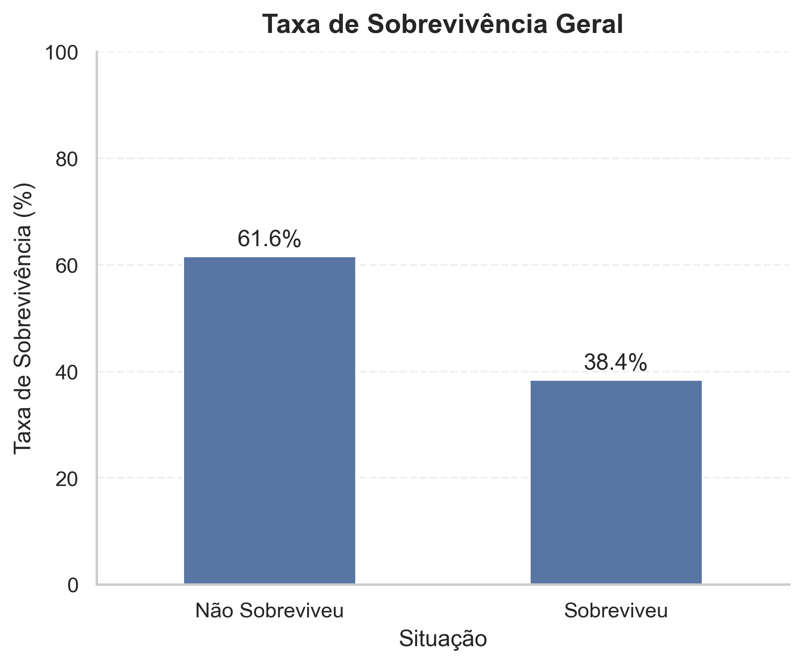
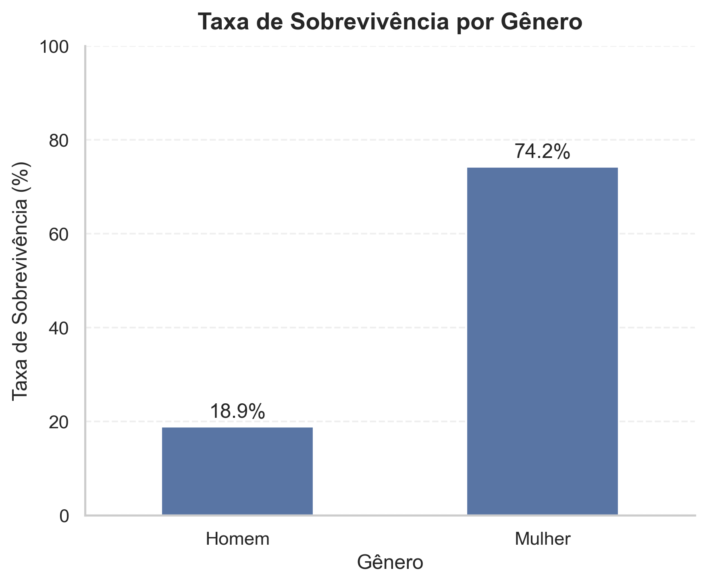
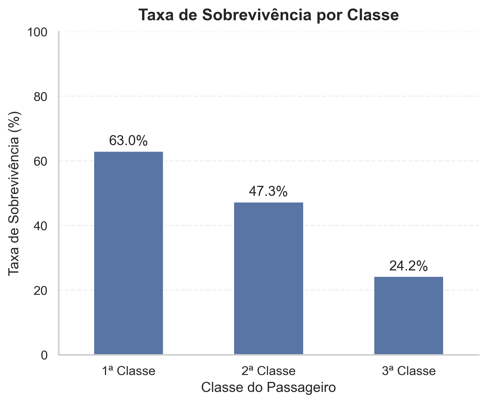
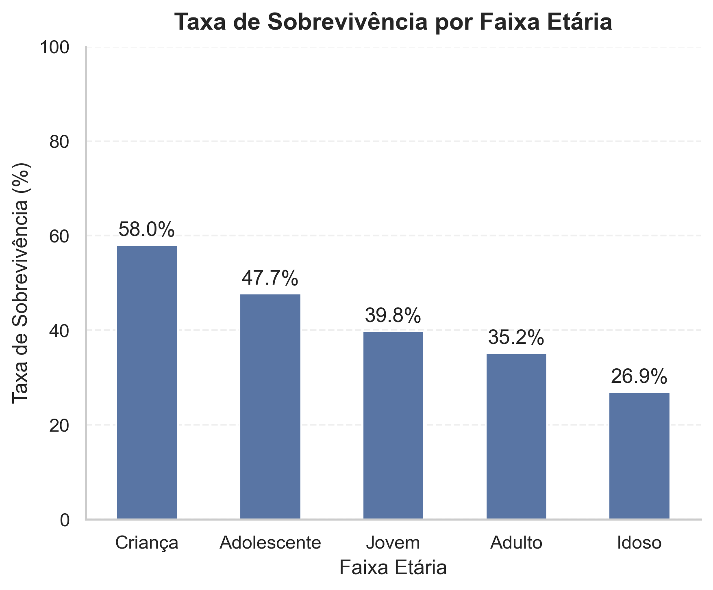
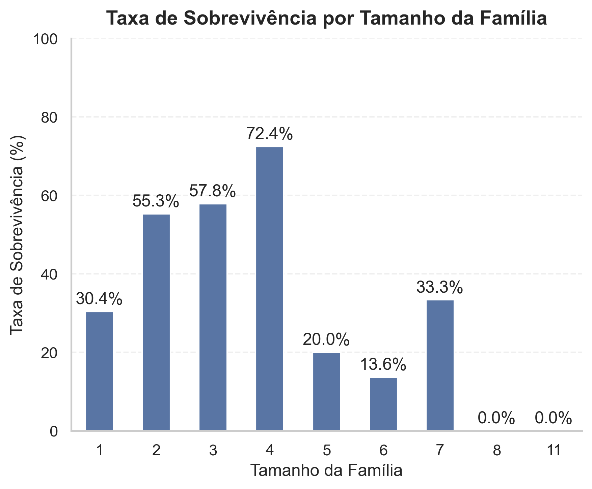
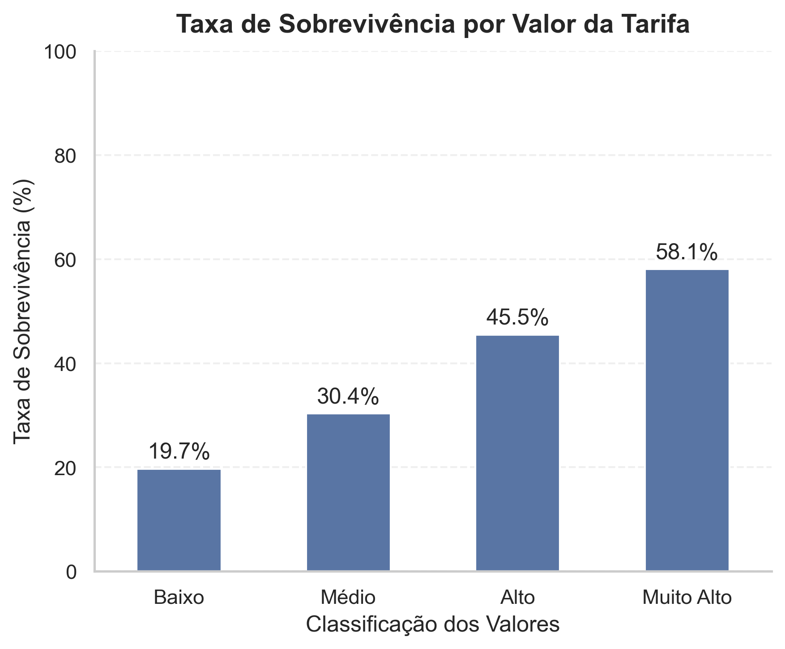

# Análise Exploratória de Dados - Titanic



## Sobre o projeto

Este projeto consiste em uma Análise Exploratória de Dados (EDA) utilizando o conjunto de dados do Titanic. O objetivo é investigar quais características dos passageiros estiveram associadas à sobrevivência durante o naufrágio, por meio de análises estatísticas e visualizações.

Ao longo do projeto, foram realizadas etapas de limpeza e tratamento dos dados, criação de novas variáveis (engenharia de features) e análises exploratórias para identificar padrões relacionados à sobrevivência dos passageiros. Todo o processo foi organizado de forma modular, facilitando a manutenção do código e a reprodutibilidade da análise.

---

## Dataset

Foi utilizado o conjunto de dados **Titanic**, amplamente empregado em estudos de Ciência de Dados e Machine Learning.

O dataset contém informações dos passageiros, como:

- Sexo;
- Idade;
- Classe do passageiro;
- Valor da tarifa;
- Porto de embarque;
- Quantidade de familiares;
- Situação de sobrevivência.

---

## Objetivo

Este projeto busca responder às seguintes questões:

- Identificar fatores associados à sobrevivência;
- Compreender o perfil dos sobreviventes.

---

## Tecnologias utilizadas


---

## Estrutura do projeto

O projeto foi organizado em módulos para separar as etapas de limpeza, engenharia de atributos, cálculo de métricas e visualização dos dados, facilitando a manutenção e a reutilização do código.

```text
Titanic/
├── data/
│   ├── raw/
│   │   └── train.csv
│   └── processed/
│       └── train_limpo.csv
│
├── notebooks/
│   └── analise.ipynb
│
├── reports/
│   └── figures/
│       ├── sobrevivencia_geral.png
│       ├── sobrevivencia_genero.png
│       ├── sobrevivencia_classe.png
│       ├── sobrevivencia_classe_genero.png
│       ├── sobrevivencia_faixa_etaria.png
│       ├── sobrevivencia_tamanho_familia.png
│       └── sobrevivencia_valor_tarifa.png
│
├── src/
│   ├── cleaning.py
│   ├── features.py
│   ├── statistics.py
│   ├── visualization.py
│   └── __init__.py
│
├── .gitignore
├── README.md
└── requirements.txt
```

---

## Etapas da análise

O projeto foi desenvolvido seguindo um fluxo estruturado de análise exploratória de dados, composto pelas seguintes etapas:

1. Definição do problema;
2. Importação das bibliotecas;
3. Leitura dos dados;
4. Exploração inicial dos dados;
5. Limpeza e tratamento dos dados;
6. Engenharia de features;
7. Análise exploratória dos dados (EDA);
8. Conclusões.

---

## Principais resultados

A análise exploratória identificou alguns padrões associados à sobrevivência dos passageiros.

### Sobrevivência por gênero



Mulheres apresentaram taxa de sobrevivência superior a **70%**, enquanto entre os homens a taxa ficou próxima de **20%**, indicando uma forte associação entre gênero e sobrevivência.

---

### Sobrevivência por classe



Passageiros da **1ª classe** apresentaram taxa de sobrevivência superior a **60%**, enquanto na **3ª classe** a taxa ficou próxima de **25%**, indicando uma forte associação entre classe e sobrevivência.

---

### Sobrevivência por faixa etária



Foi observada uma tendência de redução da taxa de sobrevivência conforme a idade aumentava. As crianças apresentaram a maior taxa de sobrevivência entre todas as faixas etárias.

---

### Sobrevivência por tamanho da família



Famílias compostas por **2 a 4 pessoas** apresentaram as maiores taxas de sobrevivência, enquanto passageiros que viajavam sozinhos ou em famílias muito grandes apresentaram taxas menores.

---

### Sobrevivência por valor da tarifa



Foi observada uma tendência contínua de aumento da taxa de sobrevivência conforme aumentava o valor pago na tarifa, resultado consistente com a análise por classe.

---

## Como executar

1. Clone este repositório:

```bash
git clone https://github.com/CarlosAlexandreOM/Titanic.git
```

2. Acesse a pasta do projeto:

```bash
cd Titanic
```

3. Crie e ative um ambiente virtual (opcional, mas recomendado).

### Windows

```bash
python -m venv .venv
.venv\Scripts\activate
```

### Linux/macOS

```bash
python3 -m venv .venv
source .venv/bin/activate
```

4. Instale as dependências:

```bash
pip install -r requirements.txt
```

5. Abra o notebook:

```text
notebooks/analise.ipynb
```

ou execute:

```bash
jupyter notebook
```

e abra o arquivo `analise.ipynb`.

> **Observação:** O conjunto de dados original está disponível em `data/raw/train.csv`. O arquivo `data/processed/train_limpo.csv` corresponde à versão tratada utilizada durante a análise.

---

## Próximos passos

Como possíveis evoluções deste projeto:

- Desenvolver modelos preditivos de Machine Learning;
- Criar dashboards interativos para exploração dos resultados;
- Automatizar o pipeline de preparação dos dados;
- Aplicar a mesma metodologia em outros conjuntos de dados reais.

---

## Autor

Desenvolvido por **Carlos Alexandre** como parte do meu portfólio de projetos em Ciência e Análise de Dados.

- GitHub: https://github.com/CarlosAlexandreOM
- LinkedIn: https://www.linkedin.com/in/carlosalexandreoliveiramello